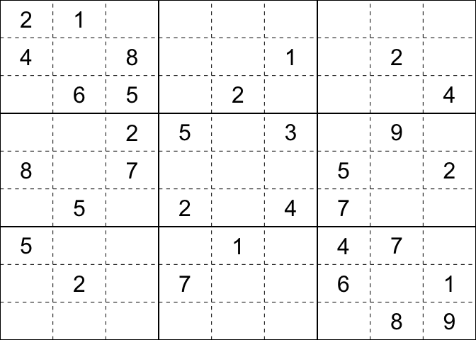

<!-- badges: start -->
[](https://travis-ci.org/alexpavlakis/sudokuplyr) <!-- badges: end -->

sudokuplyr
==========

The goal of sudokuplyr is to provide simple functions for solving, creating, and analyzing sudoku puzzles in R. Key functions include:

-   `solve_sudoku`
-   `is_unique`
-   `is_legal`
-   `print_sudoku`
-   `generate_sudoku`
-   `generate_puzzle`
-   `get_all_solutions`
-   `analyze_sudoku`

Installation
------------

You can install sudoku from github with:

``` r
# install.packages("devtools")
devtools::install_github("alexpavlakis/sudoku")
```

Examples
--------

The workhorse function is `solve_sudoku`, which takes three main arguments:

-   `sudoku_matrix`: an unsolved sudoku puzzle in matrix form, with `NA` in unknown cells;
-   `verbose`: `TRUE` if you want the function to print intermediate steps (defaults to `FALSE`)
-   `shuffle`: `TRUE` if you want to induce randomness in the backtracking algorithm used if the logical algorithm fails (defaults to `TRUE`).

`is_legal` will tell you if a puzzle is completed correctly. `is_unique` will tell you if an unsolved puzzle has a unique solution.

`solve_sudoku` first attempts to solve the sudoku with basic sudoku logic. If this does not work, it uses a backtracking algorithm to find a solution (if one exists). Core functions are written in C++ for speed.

``` r
library(sudokuplyr)

# An unsolved puzzle
s <- as.sudoku(sudoku)
s
#>                           
#>  + - - - + - - - + - - - +
#>  | 2 1   |       |       |
#>  | 4   8 |     1 |   2   |
#>  |   6 5 |   2   |     4 |
#>  + - - - + - - - + - - - +
#>  |     2 | 5   3 |   9   |
#>  | 8   7 |       | 5   2 |
#>  |   5   | 2   4 | 7     |
#>  + - - - + - - - + - - - +
#>  | 5     |   1   | 4 7   |
#>  |   2   | 7     | 6   1 |
#>  |       |       |   8 9 |
#>  + - - - + - - - + - - - +

# Solve
solved_puzzle <- solve_sudoku(s)
solved_puzzle
#>                           
#>  + - - - + - - - + - - - +
#>  | 2 1 3 | 8 4 7 | 9 6 5 |
#>  | 4 9 8 | 6 5 1 | 3 2 7 |
#>  | 7 6 5 | 3 2 9 | 8 1 4 |
#>  + - - - + - - - + - - - +
#>  | 6 4 2 | 5 7 3 | 1 9 8 |
#>  | 8 3 7 | 1 9 6 | 5 4 2 |
#>  | 1 5 9 | 2 8 4 | 7 3 6 |
#>  + - - - + - - - + - - - +
#>  | 5 8 6 | 9 1 2 | 4 7 3 |
#>  | 9 2 4 | 7 3 8 | 6 5 1 |
#>  | 3 7 1 | 4 6 5 | 2 8 9 |
#>  + - - - + - - - + - - - +

# Check that it is correct
is_legal(solved_puzzle)
#> [1] TRUE
```

`solve_sudoku` completes puzzles in the blink of an eye. The example below shows the time taken to solve an easy puzzle (49 empty cells) and a hard puzzle (59 empty cells). The easy puzzle is solved in &lt;10 milliseconds and the hard puzzle is solved in a fraction of a second on a MacBook Air.

``` r
# Easy puzzle - 49 empty cells
sum(is.na(sudoku))
#> [1] 49

# Hard Puzzle - 59 empty cells
summary(as.sudoku(hard_sudoku))
#>                           
#>  + - - - + - - - + - - - +
#>  | 8 7   | 5     |     3 |
#>  |       |     8 |     7 |
#>  |       |   4   |       |
#>  + - - - + - - - + - - - +
#>  |     9 |       |       |
#>  |   8   | 7     |   1 6 |
#>  |     2 |   8 6 |       |
#>  + - - - + - - - + - - - +
#>  | 2     |       |       |
#>  |   5   | 1     | 2 3   |
#>  |   9 6 |       |       |
#>  + - - - + - - - + - - - +
#>  clues:           22 
#>  naked singles:   0 
#>  hidden singles:  3 
#>  legal solution:  TRUE 
#>  unique solution: TRUE
```

``` r
library(microbenchmark)
m <- microbenchmark(easy = solve_sudoku(sudoku),
                    hard = solve_sudoku(hard_sudoku), 
                    times = 100, unit = 's')
```

``` r
print(m, digits = 3)
#> Unit: seconds
#>  expr     min      lq    mean  median      uq    max neval
#>  easy 0.00458 0.00482 0.00582 0.00507 0.00555 0.0184   100
#>  hard 0.01096 0.04971 0.07086 0.07044 0.08888 0.1713   100
```

`generate_sudoku` creates randomly generated complete sudoku puzzles. The `seed` argument can be used to create reproducible random puzzles or left `NULL` (default). `generate_puzzle` creates randomly generated incomplete sudoku puzzles with a specified number of clues.

``` r
new_puzzle <- generate_puzzle(clues = 32, unique = TRUE, seed = 56)
print(new_puzzle)
#>                           
#>  + - - - + - - - + - - - +
#>  | 4   6 | 7     | 3 9   |
#>  |       |       |   6 8 |
#>  | 5     |   9   |     7 |
#>  + - - - + - - - + - - - +
#>  | 3     |     6 | 9     |
#>  |     7 |   8   | 6     |
#>  |       | 5     |   8   |
#>  + - - - + - - - + - - - +
#>  | 8     | 2 3   | 1   9 |
#>  | 2 1   |     7 |   4   |
#>  |   7 4 |       | 2   3 |
#>  + - - - + - - - + - - - +
```

`get_all_solutions` generates all possible solutions for a given puzzle. Puzzles with fewer than 20-25 clues (depending on the puzzle, of course), can have *a lot* of solutions, and this function can take a while to find them all. Beware. Most puzzles that appear in newspapers and magazines have only one solution.

``` r
# This puzzle has a lot of solutions
puzzle <- generate_puzzle(clues = 28, unique = FALSE, seed = 56)
all_solutions <- get_all_solutions(puzzle)
length(all_solutions)
#> [1] 898
```

`analyze_sudoku` returns some helpful information about sudoku puzzles. Both the easy and hard sudokus that come with the package have legal, unique solutions; but the easy sudoku has more clues, "hidden singles", and "naked singles" (unknown cells that can be populated with simple logic).

``` r
# Compare the easy and hard sudokus that come with the package
analyze_sudoku(sudoku)
#>                           
#>  + - - - + - - - + - - - +
#>  | 2 1   |       |       |
#>  | 4   8 |     1 |   2   |
#>  |   6 5 |   2   |     4 |
#>  + - - - + - - - + - - - +
#>  |     2 | 5   3 |   9   |
#>  | 8   7 |       | 5   2 |
#>  |   5   | 2   4 | 7     |
#>  + - - - + - - - + - - - +
#>  | 5     |   1   | 4 7   |
#>  |   2   | 7     | 6   1 |
#>  |       |       |   8 9 |
#>  + - - - + - - - + - - - +
#>  clues:           32 
#>  naked singles:   2 
#>  hidden singles:  18 
#>  legal solution:  TRUE 
#>  unique solution: TRUE
analyze_sudoku(hard_sudoku)
#>                           
#>  + - - - + - - - + - - - +
#>  | 8 7   | 5     |     3 |
#>  |       |     8 |     7 |
#>  |       |   4   |       |
#>  + - - - + - - - + - - - +
#>  |     9 |       |       |
#>  |   8   | 7     |   1 6 |
#>  |     2 |   8 6 |       |
#>  + - - - + - - - + - - - +
#>  | 2     |       |       |
#>  |   5   | 1     | 2 3   |
#>  |   9 6 |       |       |
#>  + - - - + - - - + - - - +
#>  clues:           22 
#>  naked singles:   0 
#>  hidden singles:  3 
#>  legal solution:  TRUE 
#>  unique solution: TRUE
```

The `plot` method displays a sudoku in R's graphical interface.

``` r
plot(as.sudoku(sudoku))
```


