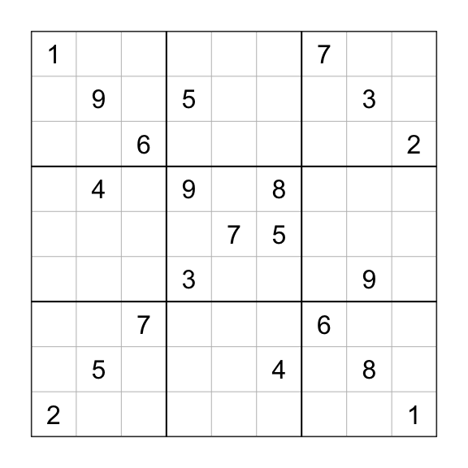

<!-- badges: start -->
[](https://travis-ci.org/alexpavlakis/sudokuplyr) <!-- badges: end -->

sudokuplyr
==========

The goal of sudokuplyr is to provide simple functions for solving, creating, and analyzing sudoku puzzles in R.

Installation
------------

You can install sudokuplyr from github with:

``` r
# install.packages("devtools")
devtools::install_github("alexpavlakis/sudokuplyr")
```

Usage
-----

The following methods are available for objects of class `sudoku`:

-   `print`
-   `plot`
-   `solve`
-   `summary`

`as.sudoku` will convert sudoku puzzles represented as matrices, vectors, or strings into objects of class sudoku.

``` r
# A sudoku in string format, with periods for unknown cells
raw_sudoku <- "1.......2.9.4...5...6...7...5.9.3.......7.......85..4.7.....6...3...9.8...2.....1"
s <- as.sudoku(raw_sudoku)

# Print
print(s)
#>                           
#>  + - - - + - - - + - - - +
#>  | 1     |       | 7     |
#>  |   9   | 5     |   3   |
#>  |     6 |       |     2 |
#>  + - - - + - - - + - - - +
#>  |   4   | 9   8 |       |
#>  |       |   7 5 |       |
#>  |       | 3     |   9   |
#>  + - - - + - - - + - - - +
#>  |     7 |       | 6     |
#>  |   5   |     4 |   8   |
#>  | 2     |       |     1 |
#>  + - - - + - - - + - - - +

# Solve
solve(s)
#>                           
#>  + - - - + - - - + - - - +
#>  | 1 2 5 | 4 9 3 | 7 6 8 |
#>  | 7 9 8 | 5 2 6 | 1 3 4 |
#>  | 4 3 6 | 1 8 7 | 9 5 2 |
#>  + - - - + - - - + - - - +
#>  | 3 4 1 | 9 6 8 | 5 2 7 |
#>  | 8 6 9 | 2 7 5 | 4 1 3 |
#>  | 5 7 2 | 3 4 1 | 8 9 6 |
#>  + - - - + - - - + - - - +
#>  | 9 1 7 | 8 3 2 | 6 4 5 |
#>  | 6 5 3 | 7 1 4 | 2 8 9 |
#>  | 2 8 4 | 6 5 9 | 3 7 1 |
#>  + - - - + - - - + - - - +

# Plot
plot(s)
```



``` r

# Summarize
summary(s)
#>                           
#>  + - - - + - - - + - - - +
#>  | 1     |       | 7     |
#>  |   9   | 5     |   3   |
#>  |     6 |       |     2 |
#>  + - - - + - - - + - - - +
#>  |   4   | 9   8 |       |
#>  |       |   7 5 |       |
#>  |       | 3     |   9   |
#>  + - - - + - - - + - - - +
#>  |     7 |       | 6     |
#>  |   5   |     4 |   8   |
#>  | 2     |       |     1 |
#>  + - - - + - - - + - - - +
#>  clues:           21 
#>  naked singles:   0 
#>  hidden singles:  0 
#>  legal solution:  TRUE 
#>  unique solution: TRUE
```

`solve_sudoku`, `print_sudoku`, `analyze_sudoku`, and `plot_sudoku` operate on 9x9 matrices directly.

`solve_sudoku` completes puzzles in the blink of an eye. The example below shows the time taken to solve an easy puzzle (49 empty cells) and a hard puzzle (59 empty cells) that come with `sudokuplyr`. Both are solved in a fraction of a millisecond on a MacBook Air.

``` r
library(microbenchmark)

m <- microbenchmark(easy = solve(sudoku),
                    hard = solve(hard_sudoku), times = 100, unit = 'ms')
```

``` r
print(m, digits = 2)
#> Unit: milliseconds
#>  expr  min   lq mean median   uq  max neval
#>  easy 0.34 0.36 0.39   0.39 0.40 0.55   100
#>  hard 0.60 0.63 0.69   0.65 0.67 1.31   100
```

`generate_sudoku` creates randomly generated complete sudoku puzzles. The `seed` argument can be used to create reproducible random puzzles or left `NULL` (default). `generate_puzzle` creates randomly generated incomplete sudoku puzzles with a specified number of clues.

``` r
new_puzzle <- generate_puzzle(clues = 32, unique = TRUE, seed = 56)
print(new_puzzle)
#>                           
#>  + - - - + - - - + - - - +
#>  | 4   6 | 7     | 3 9   |
#>  |       |       |   6 8 |
#>  | 5     |   9   |     7 |
#>  + - - - + - - - + - - - +
#>  | 3     |     6 | 9     |
#>  |     7 |   8   | 6     |
#>  |       | 5     |   8   |
#>  + - - - + - - - + - - - +
#>  | 8     | 2 3   | 1   9 |
#>  | 2 1   |     7 |   4   |
#>  |   7 4 |       | 2   3 |
#>  + - - - + - - - + - - - +
```

`get_all_solutions` generates all possible solutions for a given puzzle. Puzzles with fewer than 20-25 clues (depending on the puzzle, of course), can have *a lot* of solutions, and this function can take a while to find them all. Beware. Most puzzles that appear in newspapers and magazines have only one solution.

``` r
# This puzzle has a lot of solutions
puzzle <- generate_puzzle(clues = 28, unique = FALSE, seed = 56)
all_solutions <- get_all_solutions(puzzle, stop_early = FALSE)
length(all_solutions)
#> [1] 898
```

\`
